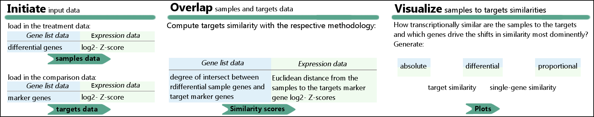

# DPre: Computational identification of differentiation bias and genes underlaying cell type conversions

## Description
DPre is a bioinformatic tool that enables the user to explore cell type conversion/ differentiation experiments. DPre may take the expression or the differentially regulated genes of the samples to rate transcriptional similarity with a reference dataset, the targets. Included are mouse- and human pre-packaged targets datasets for easy identification of differentiation bias in the samples. Further, DPre implements a function that extracts the genes accounting for the major shifts in cell type similarity. The user can visualize the transcriptional similarity between samples and targets in 3 highly customizable main plots. DPre can be run from a UNIX shell or through Python bindings.

 


## Installation and Setup

The Python packages numpy, pandas and matplotlib are required. We recommend the Anaconda distribution of Python which includes many libraries for scientific computing. 

<b>Command line (recommended)</b>:
Change into the directory you want DPre to be installed, for example /home/username/Anaconda3/Lib. Then run


```python
> git clone https://github.com/LoaloaF/DPre.git
```

You can update the repository by typing


```python
> git pull
```

<b>Manually:</b> Download the repository at https://github.com/LoaloaF/DPre and place the folder in the directory of your choice, for example at  /home/username/Anaconda3/Lib. 


For using DPre with <b>Python bindings</b>, i.e. running <i>import DPre</i> in a Python script, the PYTHONPATH variable needs to include the directory where DPre was installed. The example folder /home/username/Anaconda3/Lib is already included. If this is not the case, add 


```python
export PYTHONPATH=/Users/name/tools:$PYTHONPATH
```

to the <i>&#126;/.bash_profile</i> on Mac or <i>&#126;/.bashrc</i> on Linux. On windows, edit the system variables under <i>Properties > Advanced System Settings > Environment Variables</i>

The <b>command line interface</b> is used by running


```python
> python path/to/DPre/dpre.py <arguments>
```

DPre comes with thorough documentation. To get started, I recommend to read the docs/DPre user guide.html and have a look through the three documented examples (Python script and commands) featured in the publication. An extensive reference of the command line and Python interface can be found in docs/documentation.

## Quickstart
Initiate samples and targets with the input data, then call one of the three similarity visualization functions:


```python
import DPre

s = DPre.samples(expression='examples/example1_hsliver/hsliver_expression.tsv', ctrl='Day00')

human = DPre.preset_targets('human')
endoderm = DPre.preset_targets('h endoderm')
hep = endoderm.slice_elements(['Hepatocyte'])

t_hm = human.target_similarity_heatmap(samples=s)
bp = endoderm.ranked_similarity_barplot(samples=s)
g_hm = hep.gene_similarity_heatmap(samples=s)
```

or


```python
> python dpre.py -pt "h endoderm" -se "examples/example1_hsliver/hsliver_expression.tsv" -c "Day00" target_sim
> python dpre.py -pt "human" -se "examples/example1_hsliver/hsliver_expression.tsv" -c "Day00" ranked_sim
> python dpre.py -pt "human" -ts "Hepatocyte" -se "examples/example1_hsliver/hsliver_expression.tsv" -c "Day00" gene_sim
```

to generate

 

# License

DPre is distributed under the MIT license:

Copyright 2019 Simon Steffens

Permission is hereby granted, free of charge, to any person obtaining a copy of this software and associated documentation files (the "Software"), to deal in the Software without restriction, including without limitation the rights to use, copy, modify, merge, publish, distribute, sublicense, and/or sell copies of the Software, and to permit persons to whom the Software is furnished to do so, subject to the following conditions:

The above copyright notice and this permission notice shall be included in all copies or substantial portions of the Software.

THE SOFTWARE IS PROVIDED "AS IS", WITHOUT WARRANTY OF ANY KIND, EXPRESS OR IMPLIED, INCLUDING BUT NOT LIMITED TO THE WARRANTIES OF MERCHANTABILITY, FITNESS FOR A PARTICULAR PURPOSE AND NONINFRINGEMENT. IN NO EVENT SHALL THE AUTHORS OR COPYRIGHT HOLDERS BE LIABLE FOR ANY CLAIM, DAMAGES OR OTHER LIABILITY, WHETHER IN AN ACTION OF CONTRACT, TORT OR OTHERWISE, ARISING FROM, OUT OF OR IN CONNECTION WITH THE SOFTWARE OR THE USE OR OTHER DEALINGS IN THE SOFTWARE.

# Reference

Author: Simon Steffens<br>

Publication: ***<br>

Citation: ***<br>

